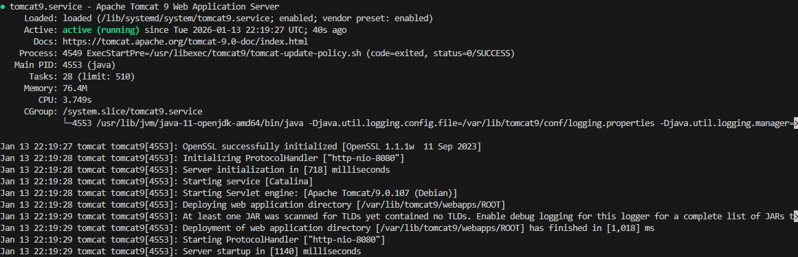
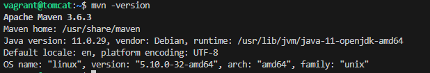
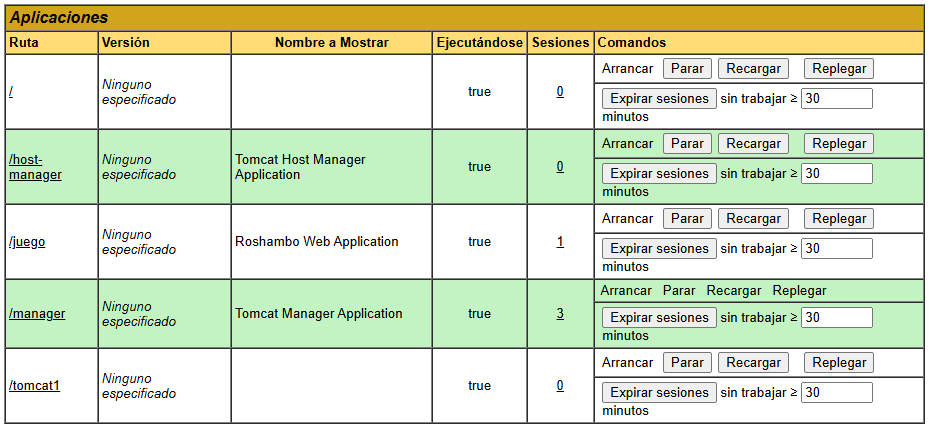
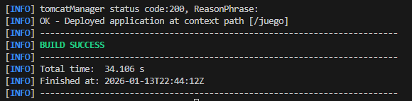
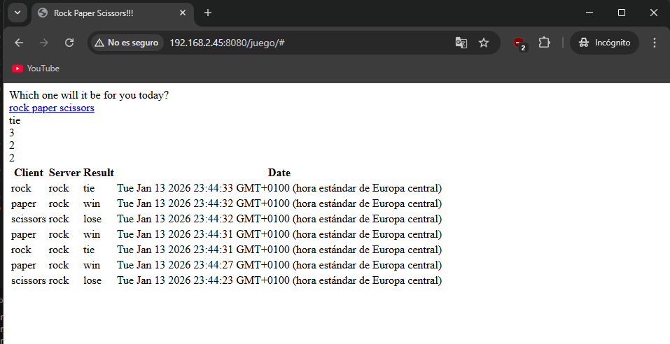

# Práctica Tomcat y Maven: Despliegue de aplicaciones Java

## Sumario:

1. Instalación del servidor
2. Configuración del servidor
3. Instalación y configuración de Maven
4. Despliegue manual
5. Despliegue automático con Maven (Tarea)

## 1. Instalación del servidor

Para esta práctica utilizaremos Tomcat 9. Primero, instalamos el kit de desarrollo de Java (OpenJDK 11):

`sudo apt install -y openjdk-11-jdk`

A continuación, instalamos el servidor de aplicaciones Tomcat:

`sudo apt install -y tomcat9`

Creamos un grupo y un usuario específico para el servicio, asignándole el directorio `/etc/tomcat9` como _home_ y desactivando su login (`/bin/false`) por seguridad:

```
sudo groupadd tomcat9
sudo useradd -s /bin/false -g tomcat9 -d /etc/tomcat9 tomcat9

```

Iniciamos el servicio y comprobamos que está corriendo:

```
sudo systemctl start tomcat9
sudo systemctl status tomcat9
```



También instalamos el paquete de administración web, que nos hará falta más adelante:

`sudo apt install -y tomcat9-admin`

## 2. Configuración del servidor

Debemos configurar los usuarios que tendrán acceso al panel de administración. Editamos el fichero `/etc/tomcat9/tomcat-users.xml`.
Añadimos un usuario `alumno` para la gestión gráfica y, muy importante, un usuario `deploy` con el rol `manager-script` para los despliegues automáticos con Maven.

El fichero queda así:

```
<tomcat-users ...>
    <role rolename="admin"/>
    <role rolename="admin-gui"/>
    <role rolename="manager"/>
    <role rolename="manager-gui"/>
    <role rolename="manager-script"/>

    <user username="alumno" password="1234" roles="admin,admin-gui,manager,manager-gui"/>
    <user username="deploy" password="1234" roles="manager-script"/>
</tomcat-users>

```

Por defecto, Tomcat restringe el acceso al Manager. Para permitir el acceso, modificamos el archivo `context.xml`. Según la guía, editamos el de `host-manager`, aunque es recomendable revisar también el del `manager` normal:

`sudo nano /usr/share/tomcat9-admin/host-manager/META-INF/context.xml`

Comentamos o modificamos la válvula `RemoteAddrValve` para permitir conexiones desde nuestra IP (o todas):

```
<Valve className="org.apache.catalina.valves.RemoteAddrValve" allow="\d+\.\d+\.\d+\.\d+" />

```

Reiniciamos el servicio para aplicar cambios: `sudo systemctl restart tomcat9`.

## 3. Instalación y configuración de Maven

Instalamos Maven en el equipo:

`sudo apt-get update && sudo apt-get -y install maven`

Comprobamos la versión con `mvn -version`.



Ahora configuramos las credenciales del servidor en el archivo de configuración global de Maven `/etc/maven/settings.xml`. Añadimos el servidor `Tomcat` con el usuario `deploy` que creamos antes:

```
<servers>
  <server>
    <id>Tomcat</id>
    <username>deploy</username>
    <password>1234</password>
  </server>
</servers>

```

## 4. Despliegue manual

Para verificar que el entorno funciona, accedemos vía navegador a `http://localhost:8080/manager/html` con el usuario `alumno`.
En la sección "Archivo WAR para desplegar", seleccionamos el fichero `tomcat1.war` y pulsamos "Desplegar".

Vemos que la aplicación aparece en la lista como `/tomcat1`.



## 5. Despliegue automático con Maven

```
git clone https://github.com/cameronmcnz/rock-paper-scissors.git
cd rock-paper-scissors
git checkout patch-1

```

Editamos el fichero `pom.xml` del proyecto descargado. Añadimos el plugin de Tomcat en la sección `<build><plugins>`. Es crucial que la etiqueta `<server>` coincida con el ID puesto en el `settings.xml`:

```
<plugin>
    <groupId>org.apache.tomcat.maven</groupId>
    <artifactId>tomcat7-maven-plugin</artifactId>
    <version>2.2</version>
    <configuration>
        <url>http://localhost:8080/manager/text</url>
        <server>Tomcat</server>
        <path>/juego</path>
    </configuration>
</plugin>

```

Lanzamos la orden de Maven para desplegar:
`mvn tomcat7:deploy`
Esperamos a ver el mensaje `BUILD SUCCESS`.



Accedemos al navegador a `http://192.168.2.45:8080/juego` y comprobamos que el juego carga correctamente.


